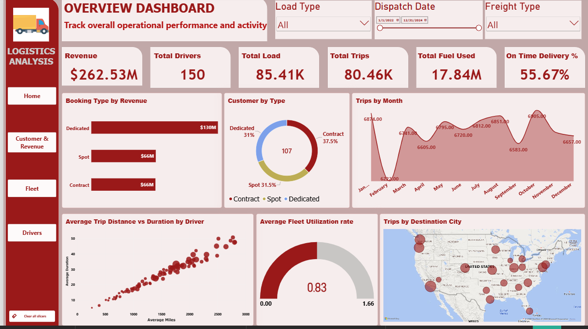
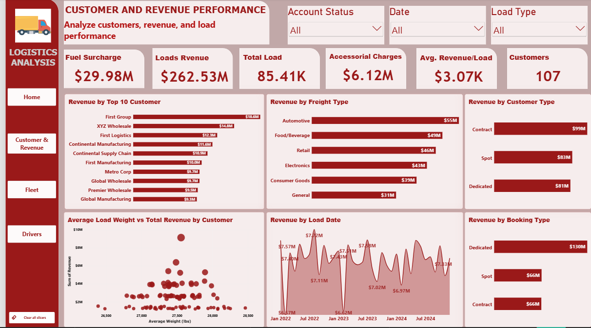
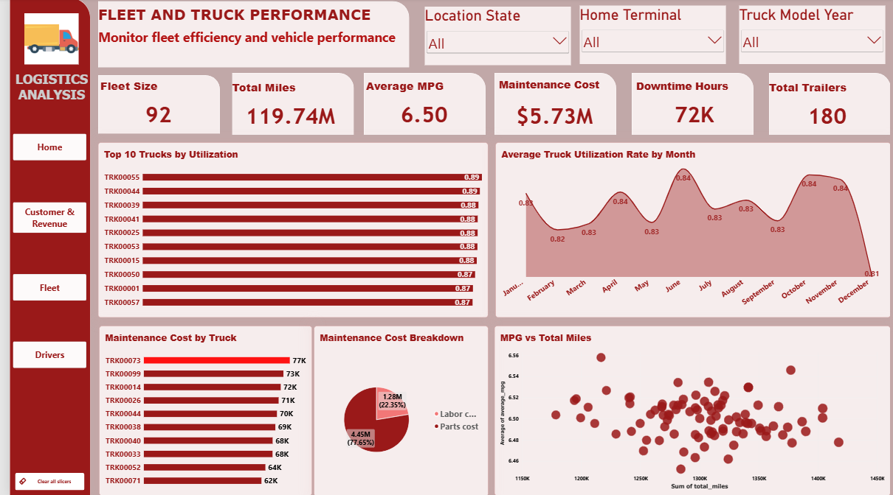
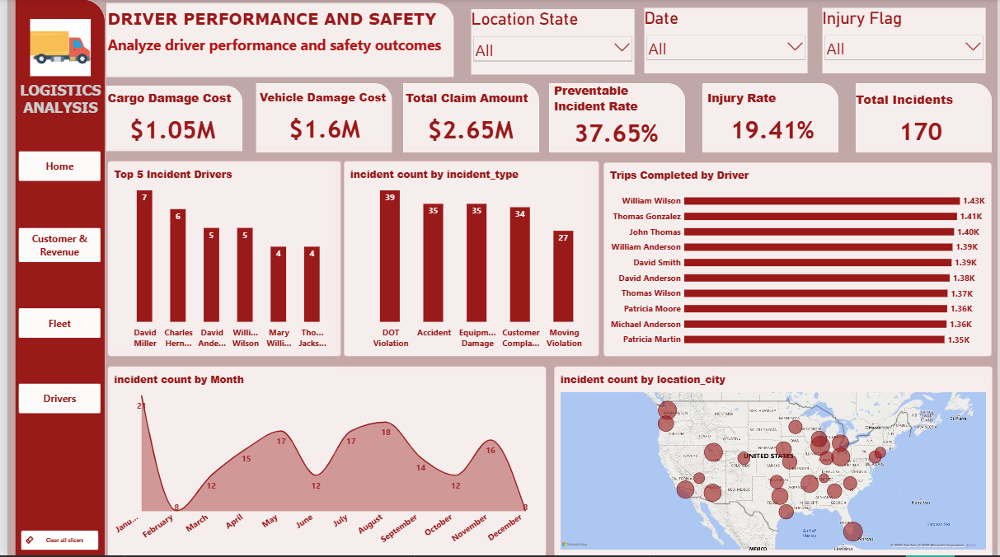

# 🚚 Logistics Analysis Dashboard

An interactive, four-page Power BI report that tracks the operational, commercial, fleet, and safety performance of a trucking and freight business over **January 2022 – December 2024**.

The report is built around four questions a logistics leader asks every day:

1. **How is the business performing overall?** (Overview)
2. **Who are we making money from?** (Customer & Revenue)
3. **Are our trucks efficient and cost-effective?** (Fleet & Truck Performance)
4. **Are our drivers safe and productive?** (Driver Performance & Safety)

---

## 📑 Table of Contents

- [Business Snapshot](#-business-snapshot)
- [Dashboard 1: Overview](#-dashboard-1-overview)
- [Dashboard 2: Customer & Revenue Performance](#-dashboard-2-customer--revenue-performance)
- [Dashboard 3: Fleet & Truck Performance](#-dashboard-3-fleet--truck-performance)
- [Dashboard 4: Driver Performance & Safety](#-dashboard-4-driver-performance--safety)
- [Key Insights](#-key-insights)
- [Recommendations](#-recommendations)
- [Tools & Skills](#-tools--skills)
- [Repository Structure](#-repository-structure)

---

## 📊 Business Snapshot

| Metric | Value |
|---|---|
| Total Revenue | **$262.53M** |
| Total Loads | 85.41K |
| Total Trips | 80.46K |
| Active Drivers | 150 |
| Fleet Size | 92 trucks / 180 trailers |
| Total Miles | 119.74M |
| Average MPG | 6.50 |
| Avg. Revenue per Load | $3.07K |
| Fleet Utilization | 83.04% |
| **On-Time Delivery** | **55.67%** ⚠️ |
| Total Incidents | 170 |
| Total Claims | $2.65M |

---

## 🏠 Dashboard 1: Overview

**Purpose:** A one-page health check of overall operational performance and activity.

**Filters:** Load Type · Dispatch Date (1/1/2022 – 12/31/2024) · Freight Type

### KPIs

| KPI | Value |
|---|---|
| Revenue | $262.53M |
| Total Drivers | 150 |
| Total Load | 85.41K |
| Total Trips | 80.46K |
| Total Fuel Used | 17.84M |
| On-Time % | 55.67% |

### Visuals & What They Show

| Visual | Insight |
|---|---|
| **Booking Type by Revenue** | Dedicated bookings dominate at **$130M (~50%)**, while Spot and Contract each contribute **$66M (~25%)**. |
| **Customer by Type** (donut) | Customer mix is fairly balanced: Contract 37.5%, Spot 31.5%, Dedicated 31%. This closely mirrors the revenue split by customer type on the Customer page, so revenue per customer is similar across types. |
| **Trips by Month** | Trip volume is stable at roughly 6.6K–6.9K per month, with a dip in **February (6,222)** and a peak in **October (6,905)**. There is little seasonality. |
| **Average Trip Distance vs Duration by Driver** | A strong positive, near-linear relationship. Trips of about 2,500–2,800 miles take about 45–50 hours on average. Outliers above the trend indicate drivers who are slower than expected. |
| **Average Fleet Utilization Rate** | Fleet utilization is **83.04%**, which is healthy and leaves about 17% capacity headroom. |
| **Trips by Destination City** (map) | Destinations cluster on the **West Coast (Pacific Northwest and California)**, the **Northeast corridor**, the **Great Lakes region**, and **Texas/Southeast**. |

**Takeaway:** Volume and utilization are strong and consistent, but **on-time performance of 55.67% is the single biggest operational weakness** on this page.

---

## 💰 Dashboard 2: Customer & Revenue Performance

**Purpose:** Analyze customers, revenue streams, and load performance.

**Filters:** Account Status · Date · Load Type

### KPIs

| KPI | Value |
|---|---|
| Fuel Surcharge | $29.98M |
| Loads Revenue | $262.53M |
| Total Load | 85.41K |
| Accessorial Charges | $6.12M |
| Avg. Revenue / Load | $3.07K |
| Customers | 107 |

### Visuals & What They Show

| Visual | Insight |
|---|---|
| **Revenue by Top 10 Customers** | **First Group ($18.6M)** leads, followed by XYZ Wholesale ($14.8M) and First Logistics ($12.3M). The top 10 customers contribute about **$116M (~44% of revenue)**. |
| **Revenue by Freight Type** | Automotive ($55M) is the largest segment, followed by Food/Beverage ($49M), Retail ($46M), Electronics ($43M), Consumer Goods ($39M), and General ($31M). Revenue is well diversified across industries. |
| **Revenue by Customer Type** | Contract ($99M, ~38%) > Spot ($83M, ~32%) > Dedicated ($81M, ~31%). The three types are close, so no single customer type dominates. |
| **Average Load Weight vs Total Revenue by Customer** | Average load weights sit in a tight **26,500–28,500 lbs** band, so revenue differences are driven by **load volume, not load weight**. A few customers stand out as high-revenue outliers (up to about $9M). |
| **Revenue by Load Date** | Monthly revenue fluctuates between about **$6.6M and $7.7M** with no clear long-term growth trend. Revenue is stable but flat. |
| **Revenue by Booking Type** | Dedicated ($130M) is double Contract ($66M) and Spot ($66M), matching the Overview page. Customers of every type book Dedicated loads, which is why booking-type and customer-type splits differ. |

**Takeaway:** Revenue is diversified by industry and stable month to month, but a meaningful share sits with a handful of customers, and growth has plateaued.

---

## 🚛 Dashboard 3: Fleet & Truck Performance

**Purpose:** Monitor fleet efficiency and vehicle performance.

**Filters:** Location State · Home Terminal · Truck Model Year

### KPIs

| KPI | Value |
|---|---|
| Fleet Size | 92 |
| Total Miles | 119.74M |
| Average MPG | 6.50 |
| Maintenance Cost | $5.73M |
| Downtime Hours | 72K |
| Total Trailers | 180 |

### Visuals & What They Show

| Visual | Insight |
|---|---|
| **Top 10 Trucks by Utilization** | TRK00055 and TRK00044 lead at **0.89**, followed by TRK00039 and several others at 0.88. The top 10 span only 0.87–0.89, so no single truck is over-used. |
| **Average Truck Utilization Rate by Month** | Utilization stays in a narrow **0.81–0.84** range. The peaks are in **June, October, and November (0.84)**. The lowest point is **December (0.81)**, which lines up with the holiday slowdown. |
| **Maintenance Cost by Truck** | The costliest trucks are **TRK00073 ($77K)**, TRK00099 ($73K), and TRK00014 ($72K). Costs across the top 10 are close together ($62K–$77K). |
| **Maintenance Cost Breakdown** | **Parts account for 77.65% ($4.45M)** and labor for 22.35% ($1.28M). Parts sourcing is the biggest cost lever. |
| **MPG vs Total Miles** | Each truck logs roughly 1.15M–1.45M miles, while average MPG stays within a narrow **6.46–6.56** band. There is no visible relationship between miles driven and fuel efficiency, so efficiency is consistent across the fleet. |

### Derived Metrics

| Metric | Calculation | Result |
|---|---|---|
| Revenue per truck | $262.53M / 92 | ≈ $2.85M |
| Revenue per mile | $262.53M / 119.74M | ≈ $2.19 |
| Maintenance cost per mile | $5.73M / 119.74M | ≈ $0.048 |
| Avg. maintenance per truck | $5.73M / 92 | ≈ $62K |
| Avg. downtime per truck | 72K / 92 | ≈ 783 hours |

**Takeaway:** The fleet is used consistently and maintenance is spread evenly. Cost reduction lies mainly in **parts spend** and **downtime**, not in a few problem vehicles.

---

## 🦺 Dashboard 4: Driver Performance & Safety

**Purpose:** Analyze driver performance and safety outcomes.

**Filters:** Location State · Date · Injury Flag

### KPIs

| KPI | Value |
|---|---|
| Cargo Damage Cost | $1.05M |
| Vehicle Damage Cost | $1.6M |
| Total Claim Amount | $2.65M |
| Preventable Incident Rate | 37.65% |
| Injury Rate | 19.41% |
| Total Incidents | 170 |

### Visuals & What They Show

| Visual | Insight |
|---|---|
| **Top 5 Incident Drivers** | David Miller has the most incidents (**7**), followed by Charles Hernandez (6), David Anderson (5), and William Wilson (5). Incidents are spread across many drivers, with no extreme concentration. |
| **Incident Count by Type** | DOT Violation (39), Accident (35), Equipment Damage (35), Customer Complaint (34), Moving Violation (27). The mix is even, so there is no single dominant failure mode. |
| **Trips Completed by Driver** | The most productive drivers each complete about **1.35K–1.43K trips** (William Wilson, Thomas Gonzalez, John Thomas). Productivity is very consistent. |
| **Incident Count by Month** | Incidents peak in **January (21)** and again in **August (18)**, with the lowest points in **February and December (8)**. |
| **Incident Count by Location** (map) | Incidents are spread nationwide, with clusters in the Pacific Northwest, California, the Midwest/Great Lakes, and the Southeast. |

### Derived Metrics

| Metric | Calculation | Result |
|---|---|---|
| Incidents per million miles | 170 / 119.74M | ≈ 1.42 |
| Avg. claim per incident | $2.65M / 170 | ≈ $15.6K |
| Preventable incidents (approx.) | 170 × 37.65% | ≈ 64 |
| Injury-related incidents (approx.) | 170 × 19.41% | ≈ 33 |

**Takeaway:** More than a third of incidents are **preventable** and about one in five involves an **injury**, so better training and compliance would deliver real savings.

---

## 🔍 Key Insights

1. **On-time delivery is the critical problem.** At 55.67%, nearly half of trips arrive late, despite 83% fleet utilization. This points to scheduling, routing, or dwell-time issues rather than a shortage of capacity.
2. **Dedicated bookings drive revenue.** They generate about 50% of revenue, and Contract and Spot each contribute about 25%.
3. **Revenue is stable but not growing.** Monthly revenue stays in a $6.6M–$7.7M band across three years.
4. **Customer concentration is moderate.** The top 10 customers make up about 44% of revenue, and First Group alone is about 7%.
5. **Industry mix is healthy.** No freight category exceeds about 21% of revenue.
6. **Parts drive maintenance cost.** Parts are 77.65% of maintenance spend.
7. **Fuel efficiency is uniform.** MPG does not degrade with mileage, so the fleet is well maintained.
8. **A large share of incidents can be prevented.** 37.65% are classed as preventable, and the incidents are spread across many drivers, which suggests a **systemic training/process issue** rather than a few "bad drivers".
9. **Seasonality shows up in safety, not volume.** Trips are flat month to month, but incidents peak in January and August.

---

## ✅ Recommendations

| Area | Recommendation |
|---|---|
| **On-Time Delivery** | Analyze late trips by lane, customer, and terminal. Add delay-reason codes and review dispatch planning and appointment windows. |
| **Revenue Growth** | Grow Contract and Spot volume, where margin and pricing may be more flexible, and protect the high-value Dedicated base. |
| **Customer Risk** | Set retention plans for the top 10 accounts and diversify to reduce dependency on First Group. |
| **Maintenance** | Negotiate parts pricing or bulk purchasing, and adopt predictive maintenance for high-cost trucks such as TRK00073. |
| **Downtime** | Set a downtime-hours target per truck and track it monthly. |
| **Safety** | Target the 37.65% preventable incidents with defensive-driving refreshers and DOT compliance checks, and run extra safety campaigns before January and August. |
| **Driver Coaching** | Use the incident and trip-productivity views together to coach drivers on incident rate per trip, not just raw counts. |

---

## 🛠 Tools & Skills

- **Power BI Desktop**: data modeling, DAX measures, interactive visuals
- **DAX**: KPIs, utilization, and cost calculations
- **Power Query**: data cleaning and transformation
- **Data Visualization**: KPI cards, slicers, maps, scatter plots, area/bar/donut charts
- **UX**: consistent theme, navigation buttons, and a "Clear all slicers" control on every page

---

## 👤 Author

**Timi** · [GitHub](https://github.com/Timi1356) · [LinkedIn](https://www.linkedin.com/in/opeyemi-shelle-3b1729277)

*Feedback and suggestions are welcome. Open an issue or submit a pull request.*
